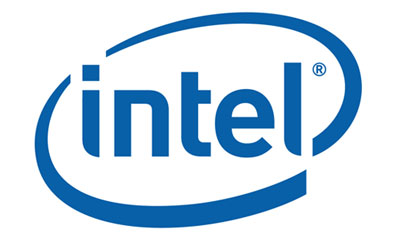

# 인텔코리아 강의자료 - 딥러닝을 이용한 이미지 분류
(Intel Koera - Image Classification using Deep Learning)



본 강의 자료는 인텔코리아에서 진행하는 딥러닝 관련된 교육 자료이므로 무단으로 사용시 법적 제재가 있을 수 있습니다. 
인텔코리아 강의 자료를 Backend.AI 실습을 위해서 편집되었으며 본 자료의 원 소유권은 저작권자에게 있습니다. 

---

## Purpose
> Backend.AI 환경에서 Keras를 프레임워크를 이용하여 여러가지 데이터셋을 다양한 CNN모델을 학습하여 이미지 분류를 하는 튜토리얼입니다.

---

## Enviroments
모든 강의자료는 Backend.AI에서 1.14-py36-intel 을 설정해서 세션을 실행합니다. 
소스 코드 저장소로부터 git 명령어를 이용하여 소스코드를 자신이 실습할 저장소로 받습니다. 

```zsh
> git clone https://github.com/mssung94/intel-image-classification.git
> cd intel-image-classification
```

---

## Data & Model
강의에서 사용할 자료는 전부 Google Drive에 업로드에 되어있습니다. 다운로드 후 사용하시길 바랍니다.
Backend.AI를 사용한 실습에 어려움이 생긴다면 `hephaex@gmail.com`로 연락주시길 바랍니다.

### Data List
데이터를 다운로드 후 `data`폴더 안에 옮겨주시길 바랍니다.
- Fashion MNIST : https://drive.google.com/open?id=1H-hCU9xULhORBbSlnyAXfzJPR-6myFai
- Kaggle Cat & Dog : https://drive.google.com/open?id=1udAgSe0hqUzkqvl_PoHIYvCD-V_z-v0B
- Kaggle Intel Scene Image : https://drive.google.com/open?id=1ec4Urjxvif0fenMyl6Jl1A1SW104yiDW
- VOC2012 : https://drive.google.com/open?id=10oEH4JDSLA6ifMayOqP0NhoymjcCiDDG

### Model
모델을 다운로드 후 `bin`폴더 안에 옮겨주시길 바랍니다.
- 20가지 클래스가 학습된 MobileNet : 

---

## Contents
천천히 단계적으로 따라올 수 있도록 강의를 구성했습니다. 처음에는 딥러닝에 대한 기초지식과 **`Keras`** 를 통하여 간단하게 CNN모델을 만드는 것부터 시작하여 후반에는 VGG16, ResNet 및 MobileNet의 Pretrained Model을 가지고 다양한 데이터셋을 학습하여 이미지를 분류합니다. 

|순서|내용|
|---|---|
|1강 |딥러닝에 대한 기본적인 지식과 이미지 분류를 하기 위한 CNN 구조 설명|
|2강 |`간단한 CNN 모델`을 만들어 **MNIST 데이터셋**을 학습 후 이미지 분류|
|3강 |`간단한 CNN 모델`을 만들어 **Fashion MNIST 데이터셋**을 학습 후 이미지 분류|
|4강 |`조금 더 깊은 CNN 모델`을 만들어 **CIFAR10 데이터셋**을 학습 후 이미지 분류|
|5강 |`VGG16 모델`을 통하여 **Kaggle Cat & Dog 데이터셋**을 학습 후 이미지 분류|
|6강 |`ResNet50 모델`을 통하여 **CIFAR100 데이터셋**을 학습 후 이미지 분류 (*변경예정*)|
|7강 |`ResNet50 모델`을 통하여 **Kaggle Intel Scene Image 데이터셋**을 학습 후 이미지 분류|
|8강 |`MobileNet 모델`을 통하여 **VOC2012**에 속해 있는 20가지 데이터셋을 학습 후 이미지 분류|

## Licence
The MIT License (MIT)
Original Copyright (c) 2019 Minsuk Sung, Hoesung Ryu
Modified by Mario Cho / m.cho@Lablup.com

## Reference
- Intel Korea : https://www.intel.co.kr/content/www/kr/ko/company-overview/company-overview.html
- Kaggle Cat & Dog (Original) : https://www.kaggle.com/c/dogs-vs-cats
- Kaggle Intel Scene Image (Original) : https://www.kaggle.com/puneet6060/intel-image-classification
- VOC2012 (Original) : http://host.robots.ox.ac.uk/pascal/VOC/voc2012/
- MobileNet : https://arxiv.org/pdf/1704.04861.pdf
- MobileNetV2 : https://arxiv.org/pdf/1801.04381.pdf

## Contact
> 성민석(Minsuk Sung) : mssung94@gmail.com  
> 류회성(Hoesung Ryu) : skainof23@gmail.com
